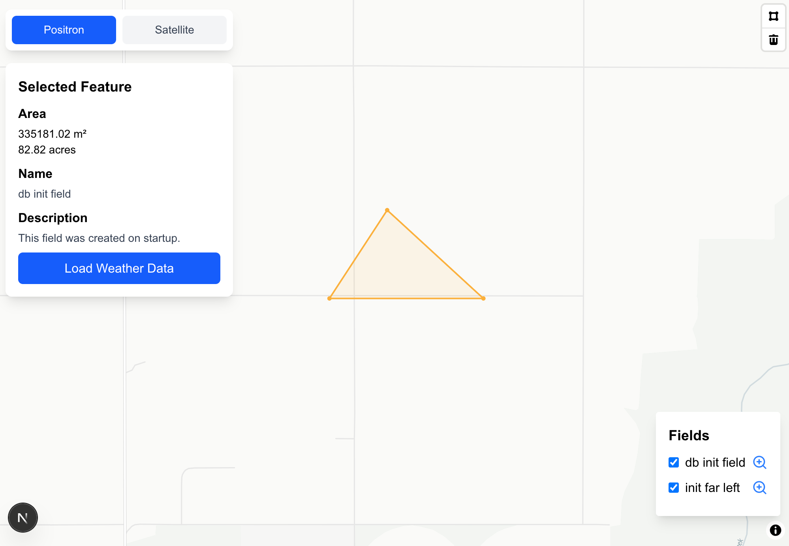

# Geo-Weather Field Visualizer

### Watch The Video Demo

[Geo-Weather Field Visualizer Demo](https://youtu.be/oTxpSwPaxIo)



### Setup With Docker
```zsh
git clone https://github.com/erichmond33/agroptics.git
cd agroptics
cp env.example .env.local
docker compose up --build
```

### Architectural Overview

Here is a tree of the most important files which I'll use to reference the key components of this project.

```zsh
agroptics/
├── backend/
│   └── src/
│       ├── db/
│       │   └── init.sql
│       ├── middleware/
│       │   └── zod.middleware.ts
│       ├── utils/
│       │   └── geoUtils.ts
│       ├── db.ts
│       └── index.ts
├── components/        
├── node_modules/      
├── public/            
├── src/
│   ├── app/
│   │   └── page.tsx
│   └── features/
│       └── map/
│           ├── components/
│           │   ├── BasemapSwitcher.tsx
│           │   ├── ControlPanel.tsx
│           │   ├── FeatureForm.tsx
│           │   ├── Legend.tsx
│           │   └── WeatherViewer.tsx
│           ├── styles/
│           │   └── mapboxDrawStyles.tsx
│           └── utils/
│               ├── backendApi.tsx
│               ├── drawControl.tsx
│               └── mapManager.tsx
```

So the frontend is the root directory with the entirety of the backend housed with agroptics/backend. Let's break down the backend files and structure first.

The bulk of the express.js backend is in index.ts – here you can find all the GET, POST, PUT, and DELETE functions. index.ts relies on utils/geoUtils.ts for some helper functions mainly related to calculating the distance to the nearest weather station. The schema is defined and seeded in init.sql, and our validation is done through Zod with zod.middleware.ts.

For the frontend, page.tsx is the main file that handles the the maplibre initilization and watches for any event changes with most of the logic abstacted away into either visual components (features/map/components) or into utilites (features/map/utils). The bulk of the application logic is in mapManager.tsx which works closely with drawControl.tsx – these two files manage MapLibre and MapBox Draw. mapManager.tsx also uses methods to call our backendApi.tsx functions.

The components (BasemapSwitcher.tsx, ControlPanel.tsx, etc) are fairly simple React components with minimal logic to display any information we might need.

### Known Limitations

I did not make this responsive; although, it wouldn't be too difficult to do so simply hiding our UI in an offcanvas on smaller screens. There are likely some Next.js naming or file structure conventions I’m not fully familiar with, but those should be easy to adjust.

While recording the demo, I discovered a minor bug: if you select a field and click “Load Weather Data,” then choose a different field without first deselecting the original, the weather data for the initially selected field is still loaded. This behavior is incorrect.
